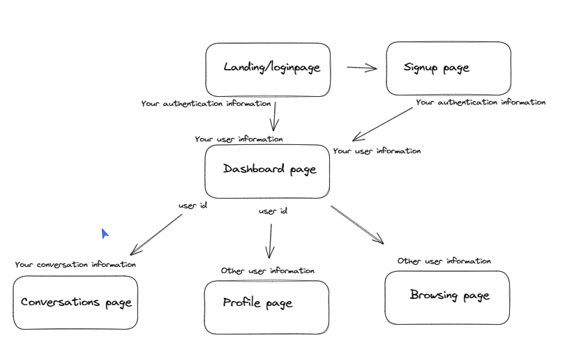

# Date-abase

This is a project with a mission to connect nerds with their dream "programming" partners ;). users will be able to create an account and dating profile by answering a few important questions to determine your best match. You can browse other people's profile and if you like the look of someone try matching with them and see if they reciprocate. If you end up lucky you'll be able to chat.

<a href="https://daterbase.netlify.app/">Deployment Link</a>

# Getting Started/Code Installation

1. Clone the back-end repository

```
git clone https://github.com/maxim-pre/Date-abase-backend.git
```

2. Navigate to this repository on your machine then run the following commands to install the project dependencies and start the development server.

```
npm install
nodemon server.js
```

3. Clone the front-end repository

```
git clone https://github.com/maxim-pre/date-abase-frontend.git
```

4. Navigate into the front-end repository on your machine and run the following commands to install all the dependencies and start the app.

```
npm install
npm run start
```

# Timeline

- Thursday (Afternoon, design and scoping)
- Friday (All day)
- Saturday (No obligation but working allowed)
- Sunday (No obligation but working allowed)
- Monday (No obligation but working allowed)
- Tuesday (All day)
- Wednesday (All day, MVP due)
- Thursday (All day, refactoring)
- Monday (9am check ins and final changes, 10am project presentation)

# Group planning

Our Mission

- Connect people with their dream "programming" partner ;)

Team Goals $ Values

- MVP first
- Agile working
- Open Communication
- Learning together

Team Communication Preferences

- Breakout rooms in pairs
- Slack messages at any time
- Lunchtime synchronised pulling and merging
- end of day review

Approach

- Backend first, break into 2 pairs and work on different parts of the backend (use Postman to verify
- Then change the pairings and repeat for the frontend

# Technologies Used

## Stack

- **MongoDB**
- **Express**
- **React**
- **Node.js**
- **Tailwind CSS**

## Npm Packages

- **Mongoose**
- **Bcrypt**
- **Passport**
- **React-modal**
- **React-icons**

## Other technologies

- **Cloudinary**
- **Vscode**
- **Git**
- **Heroku**
- **Netlify**

# Technical Requirements

## Client (Front End)

- Have a working, interactive React app, built using npx create-react-app client

  - have a minimum of 6 components
  - use only react for DOM manipulation

- Consume data from your API , and render that data in your components.

- Utilise React Router
- Authentication!

## Server (Back End)

- Have a working generic router actions for CRUD using Express, Mongoose and MongoDB
- Have at least 2 modals
- Have full CRUD on at least one of your models
- Authentication!

## Styling

- Use flexbox or CSS Grid layout
- implement responsive design on 2 screen sizes (including desktop and mobile)
- You can use a CSS framework if you want to.

## Deployment

- Deploy to MongoDB database to MongoDB Atlas
- Deploy the back-end via Heroku
- Deploy the front-end via netlify

# Planning



View Schema diagram here:

https://excalidraw.com/#room=9c9f4fc8e1279bd72d46,vo3AP7_F2bYc7GiY1E9DCQ

View wireframes here:

https://xd.adobe.com/view/4cc19f9e-36f6-404a-8564-083fd55380cd-1992/?fullscreen&hints=off

## User stories

MVP

- As a user I want to create an account so I can create a personalised experience
- As a user I want to create a bio so I can show potential partners what I’m like
- As a user I want to edit my bio so I can keep it up to date
- As a user I want to answer survey questions so that the website can match me with people that have similar interests.
- As a user I want to specify my gender and which gender(s) I’m interested in so I only see partners who are mutually interested in each other
- As a user I want to browse other users’ profiles so I can learn more about them
- As a user I want to select my favourite users so I can express my interest in them
- As a user I would like the option to select or reject any profile I want

Beyond MVP

- As a user I want to be notified when someone favourites me so I can see if we are interested in each other
- As a user I want to message users I have matched with so we can arrange a date
- As a user I want to be notified when I have favourited someone and they have favorited me, so I can know we are both interested in each other
- As a user I want to upload a photo of myself so other users know what I look like
- As a user I want to get some helpful chat up lines so I can break the ice with my date more easily
- As a user I want to see only the users near me so I can meet them without travelling too far


# Build/Code Process

## Backend

The first step in building the back-end was to initialize the express application, which involved the following steps:

1. Establish a database connected with Mongoose

```Javascript
mongoose.connect(currentDB, { useNewUrlParser: true });
db.once("open", () => console.log("Connected to MongoDB"));
db.on("error", (error) => console.log(`ERROR: ${error.message}`));
db.on("connected", () => console.log(`MongoDB connected at ${currentDB}`));
db.on("disconnected", () => console.log("MongoDB disconnected"));
```

2. instantiate the express application object

```Javascript
const app = express();
```

3. apply middlewares

```javascript
app.use(express.json()); #parse the request body into JSON
app.use(cors({ origin: "*" }));
```

4. tell the application which port to listen for requests

```javascript
app.listen(port, () => console.log(`Date-abase is listening on port ${port}`));
```

Next we split up and started working on different components of the API. I was responsible for implementing the User model and routes, as well as implementing user Authentication with postman.

I started off by creating the User model with Mongoose

```Javascript
const userSchema = new mongoose.Schema(
  {
    firstName: { type: String, required: true },
    lastName: { type: String, required: true },
    password: { type: String, required: true },
    username: { type: String, required: true },
    gender: String,
    bio: String,
    age: Number,
    photoOne: String,
    photoTwo: String,
    photoThree: String,
    interestedInGender: { type: [String], required: true },
    location: String,
    matches: [String],
    surveyAnswersId: Number,
  },
  { timestamps: true }
);

const User = mongoose.model("User", userSchema);
```

Next I started to implement the user controllers to handle requests to the user endpoints.

For Example here the controller function I wrote to handle requests to create a new user.

```Javascript
const createUser = async (req, res) => {
  try {
    const userInformation = req.body.user;
    userInformation.password = bcrypt.hashSync(
      userInformation.password,
      10
    );
    const newUser = await User.create(userInformation);
    res.status(200).json({ user: newUser });
  } catch (error) {
    res.status(406).json(error);
  }
};
```

Here you can see that I'm using Bcrypt to hash the Users password before it's stored in the database.

Next I started implementing the route to authenticate the user. I created the following function to check if the passed username and password are valid

```javascript
const checkUser = async (username, password, res) => {
  const user = await User.findOne({ username: username });
  if (user) {
    const match = await bcrypt.compare(password, user.password);
    if (match) {
      const payload = {
        id: user.id,
      };
      const token = jwt.sign(payload, jwtOptions.secretOrKey, {
        expiresIn: 60,
      });
      return res.status(200).json({ success: true, token: token });
    } else {
      return res
        .status(400)
        .json({ success: false, message: "invalid username or password" });
    }
  } else {
    return res
      .status(400)
      .json({ success: false, message: "invalid username or password" });
  }
};
```

Then I implemented the Login route

```javascript
router.post("/api/login", async (req, res) => {
  const username = req.body.user.username;
  const password = req.body.user.password;
  if (username && password) {
    try {
      checkUser(username, password, res);
    } catch (error) {
      res.status(500).json({ error: error });
    }
  } else {
    return res
      .status(400)
      .json({ error: "username and password are required" });
  }
});
```

## Front end

My first goal with the front end was to make it so users can login and sign up. Our app was structured so that a user must be logged in to use the dating app, and when a user is not logged in they can only see the login and signup pages.

I started off by creating an instance of Axios that automatically grabs the JWT token from local storage.

```javascript
const authAxios = axios.create({
  baseURL: "http://localhost:5007",
  headers: {
    Authorization: `Bearer ${localStorage.getItem("token")}`,
  },
});
```

I then created the login and signup forms.

to login

```javascript
const submit = async () => {
  const user = {
    username: username,
    password: password,
  };
  try {
    const response = await authAxios.post(`${apiRoute}login`, { user: user });
    localStorage.setItem("token", response.data.token);
    setError("");
    window.location.href = "/";
  } catch (error) {
    setError(error.response.data.message);
  }
};
```

to signup

```javascript
const submit = async () => {
  const user = {
    firstName: firstName,
    lastName: lastName,
    username: username,
    password: password,
    interestedInGender: gender,
  };
  try {
    const response = await authAxios.post(`${apiRoute}users`, { user: user });
    if (response.status === 200) {
      const loginResponse = await authAxios.post(`${apiRoute}login`, {
        user: { username: user.username, password: user.password },
      });
      localStorage.setItem("token", loginResponse.data.token);
      setError("");
      window.location.href = "/";
    }
    setError("");
    window.location.href = "/";
  } catch (error) {
    setError(error.response.data.message);
  }
};
```

Having implemented the ability for Users to login and signup. I could then implement conditional routing in the app.js file.

Throughout the rest of the projects I contributed across most areas of the frontend but primarily with the dashboard. Perhaps the thing I was most happy with was implementing the image upload widget and creating the photo scroller component.

The was an extremely important feature to add considering the project is a dating app.

I used Cloudinary to create the following upload widget.

```javascript
const UploadWidget = ({ handleUploadImage, user, setUser }) => {
  const cloudinaryRef = useRef();
  const widgetRef = useRef();
  useEffect(() => {
    cloudinaryRef.current = window.cloudinary;
    widgetRef.current = cloudinaryRef.current.createUploadWidget(
      {
        cloudName: "dxhrzidss",
        uploadPreset: "erss230u",
      },
      (error, result) => {
        if (result.event === "success") {
          handleUploadImage(result.info["public_id"], user, setUser);
        }
      }
    );
  }, []);

  return (
    <button
      className="bg-red-500 rounded px-2 text-white font-bold"
      onClick={() => widgetRef.current.open()}
    >
      Change
    </button>
  );
};
```

Here I am using a useEffect hook to instantiate the upload widget and to define the callback function when a photo is uploaded.

To render the images from Cloudinary I created the following component.

```javaScript
const UserPhoto = ({ imageUrl }) => {
  const myCld = new Cloudinary({
    cloud: {
      cloudName: "dxhrzidss",
    },
  });

  return (
    
  );
};
```

# Challenges

- Deploying the project which was something I handled on my own last minute before the deadline. It took me a while to realise that heroku doesn't recongnise .env variables but instead heroku needs to be given its own config vars.

- Pull Requests. There were a few times when bugs were pulled into the upstream repository. This was a huge time waste because It would halt progress for the entire team until we could resolve it.

# Wins

- I am pleased that our team worked seamlessly together. Throughout the project there was amazing communication, collaboration and clarity between the team members. This made debugging, pair programming and resolving merge conflicts a breeze

- I am happy with my implementation of authentication using postman.

# Key Learnings/Takeaways

- This was my first project where I've built an API with Express and I found using the library very intuitive and enjoyable.

- Working with a cloud service to store images

# Future improvements

- The UI could be improved a lot
- I would like to add an algorithm to match users. Currently users can be matched with anyone in their gender preference.
- I would like to add the ability for users to have a live chat someone they've matched with
